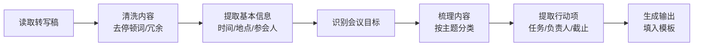

---
tags:
  - TRAE
  - SOLO
  - Skill
  - 极客时间
type: 课程笔记
status: 完成
created: 2026-05-16
updated: 2026-05-16
source: "极客时间 · Claude Code Skill 入门实战课 · 陈燊燊"
duration: "10:10"
skill: "meeting-minutes"
---

# 01｜会议纪要：从环境搭建到创建第一个 Skill

> Skill 名：`meeting-minutes` — 从文字转写稿生成结构化会议纪要。输入：录音转写稿。输出：Markdown 格式的会议纪要，包含基本信息、会议目标、讨论内容和行动项。

> [!note] 通俗摘要
> 本节是入门第一课，目标是让你完整走一遍「创建 Skill」的流程。场景选的是**会议纪要**——这是最通用的职场场景：有录音转写稿，但原始内容里充斥着「嗯」「啊」「那个」等停顿词，信息散乱，需要 AI 帮你清洗+结构化。这节课的重点不是会议纪要本身，而是**理解 Skill 的文件结构和工作流程设计思路**。

## 核心概念

**Skill 文件结构**

```
skill/meeting-minutes/
├── SKILL.md           ← 主指令：触发条件 + 工作流
├── assets/
│   └── template.md   ← 输出模板（会议纪要结构）
└── references/
    └── patterns.md   ← 识别模式（停顿词过滤、信息提取）
```

> *📌 SKILL.md 只写「做什么」和「怎么做」，具体的模板和识别规则抽出到 assets/ 和 references/ ——这样主文件简洁，规则可单独维护。*

**7 步工作流**



**停顿词过滤**

删除：嗯、啊、哦、呃、那个、这个、就是说、对对对……

保留：逻辑连接词（因为、所以、但是、然而）

**不确定内容处理**

遇到无法确认的信息（如人名不清晰、时间模糊）→ 标注 `[需确认]`，不编造。

**行动项识别模式**

- `XX 负责...` → XX 是负责人
- `尽快、抓紧时间` → 标注「[待确认具体时间]」
- 相对时间（今天下午、下周一）→ 需结合会议日期换算成具体日期

## Skill 创建提示词

> 课程中演示环境搭建后，用 `skill-creator` 创建会议纪要 Skill 的关键提示词核心逻辑（lesson1 配套资料以 SKILL.md 直接提供，prompt 在视频中口述）：

**创建目标**：从会议录音文字转写稿生成结构化会议纪要
**输入**：文字转写稿（含大量停顿词和口语化内容）
**输出**：Markdown 格式会议纪要（基本信息 + 会议目标 + 讨论内容 + 行动项）

关键设计要点（提示词应覆盖）：
- 去噪规则：停顿词列表（嗯/啊/那个……）
- 信息提取模式：时间/地点/人员/目标
- 不确定内容处理：标注 `[需确认]` 而不是编造
- 行动项识别：任务 + 负责人 + 截止时间（相对时间转换为具体日期）
- 输出模板：引用 `assets/template.md`

> *📌 Lesson1 的重点是流程演示而非提示词精讲——核心在于理解「SKILL.md + assets/ + references/」的文件结构分工，以及第一次跑通整个创建→使用流程。*


1. 配套素材 `meeting_content.txt` 是一段关于「公司团建计划」的真实会议录音转写，充满口语化表达，用于验证 Skill 效果
2. 模板在 `assets/template.md`，输出格式：基本信息表 + 会议目标 + 按主题分的讨论内容 + 行动项表格
3. 识别规则在 `references/patterns.md`，包含停顿词列表、信息提取信号词、边界处理方法


