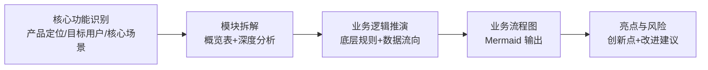

---
tags:
  - TRAE
  - SOLO
  - Skill
  - 极客时间
type: 课程笔记
status: 完成
created: 2026-05-16
updated: 2026-05-16
source: "极客时间 · Claude Code Skill 入门实战课 · 陈燊燊"
duration: "10:05"
skill: "product-reverse-analysis"
---

# 02｜竞品逆向：一张截图反推产品逻辑

> Skill 名：`product-reverse-analysis` — 产品逆向分析技能，通过产品界面截图逆向推导业务闭环、技术架构及设计哲学。输入：截图。输出：结构化分析报告（Markdown）。

> [!note] 通俗摘要
> 一张竞品截图，AI 帮你「读懂」背后的设计逻辑——产品定位是什么，模块怎么拆，业务规则怎么推，流程图怎么画，有什么亮点和风险。这个 Skill 的价值在于**把「我觉得这个设计好像是这样的」变成「系统的、可汇报的分析报告」**，大幅降低竞品分析的时间成本。

## 核心概念

**5 步分析框架**



**模块深度分析三维度**

| 维度 | 分析角度 |
|------|---------|
| 视觉层 (Visual) | 色彩心理学、视觉重心（F/Z型）、栅格系统 |
| 交互层 (Interaction) | 悬停/点击反馈、Loading/Empty/Error 状态 |
| 信息架构 (IA) | 信息层级权重、字段组织逻辑、导航结构 |

**业务逻辑推演要素**

- **底层规则**：权限控制、数据校验、算法排序、状态机
- **数据流向**：用户输入 → 前端校验 → API → 后端 → 数据库 → 响应返回

> *📌 关键一句：「根据 UI 元素推测背后的逻辑限制，明确标注推测性内容」。AI 的推测要和事实分开，避免误导。*

**模块优先级定义**

- P0：核心功能，缺失则产品不可用
- P1：重要功能，显著影响用户体验
- P2：辅助功能，锦上添花

## Skill 创建提示词

> 讲师视频中创建这个 Skill 的提示词（`lesson2/prompt.md`）：

````
使用 skill-creater 创建一个产品逆向分析 skill。
用户只需要提供一张产品截图，就能逆向推导产品的业务闭环、技术架构及设计哲学。

## Step 1: 核心功能与场景识别
- 产品定位：用一句话定义该产品/界面的核心价值
- 目标用户：分析该界面服务于哪类特定人群
- 核心场景：描述用户在什么样的情况下会打开这个界面，解决什么痛点

## Step 2: 模块拆解
### 2.1 模块概览表
使用 Markdown 表格列出界面中的主要功能模块：
| 模块名称 | 视觉位置 | 核心作用 | 优先级 (P0/P1/P2) |

### 2.2 深度模块分析
从视觉层（色彩/视觉重心/栅格）、交互层（手势反馈/状态转换）、
信息架构（层级权重/组织逻辑）三维度拆解

## 2.3 业务逻辑推演
- 底层规则：根据 UI 元素推测背后的逻辑限制
- 数据流向：分析前端输入与后端数据交换过程

## 2.4 业务流程图 (Mermaid)
使用 Mermaid 语法渲染 Sequence Diagram 或 Flowchart

## 2.5 亮点与风险
- 产品亮点：挖掘极具创新或极致体验的细节
- 潜在风险：从合规性、认知负担、极端情况角度提出建议

# Output Control
- 语气：专业、严谨、具有洞察力；语言：中文
- 格式：严格遵守上述 Markdown 结构
---
将 skill 保存到工作目录下的 .claude/skills 目录
````

> *📌 提示词末尾的「保存路径」指令是让 SOLO 把生成的 Skill 文件写入正确位置的关键。*

## 实操要点

1. 配套素材含一张产品截图 `integral-turntable.jpg`（积分转盘界面）作为练习用例
2. `prompt.md` 是课程中用于创建这个 Skill 的原始提示词，可以直接参考
3. 输出的流程图使用 Mermaid Sequence Diagram 或 Flowchart，两种都给了示例

## 在大赛中的位置

> *📌 竞品逆向分析是产品经理、设计师的高频需求。参赛时可以改造成「APP竞品分析」「小程序竞品分析」等更垂直方向，配上真实截图和对比结论会很有说服力。*

🐱 这个 Skill 就像给了 AI 一双「产品经理的眼睛」——同样看一张截图，它能帮你系统说出别人半天才能整理出来的东西。
