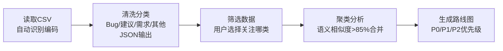

---
tags:
  - TRAE
  - SOLO
  - Skill
  - 极客时间
type: 课程笔记
status: 完成
created: 2026-05-16
updated: 2026-05-16
source: "极客时间 · Claude Code Skill 入门实战课 · 陈燊燊"
duration: "08:54"
skill: "product-requirement-miner"
---

# 03｜需求清洗：海量用户反馈生成产品需求

> Skill 名：`product-requirement-miner` — 从产品评论 CSV 数据中挖掘和分析迭代需求。支持数据清洗、分类、聚类分析和产品优化路线图生成。

> [!note] 通俗摘要
> 几千条用户评论，有骂娘的、有表情包、有真实痛点，怎么从里面提炼出可执行的产品需求？这个 Skill 把整个流程自动化：读取 CSV → 清洗分类（Bug/建议/需求/其他）→ 让你选择关注哪类 → 语义聚类去重 → 生成带优先级的产品路线图。关键创新点是**「人在环路中」——分类完让你选，不是全自动跑完。**

## 核心概念

**4 步流程**



**四类分类标准**

| 类别 | 定义 | 信号词 |
|------|------|--------|
| Bug | 功能错误、故障、崩溃 | 闪退、报错、卡死、数据丢失 |
| 建议 | 现有功能的改进意见 | 希望、建议、可以、能不能 |
| 需求 | 希望新增的全新功能 | 需要、想要、能不能加 |
| 其他 | 咨询、评价、非功能相关 | 价格、客服、感谢、怎么联系 |

**每条评论的 JSON 输出格式**

```json
{
  "is_valid": true,
  "cleaned_text": "清洗后的简洁文本",
  "category": "Bug/建议/需求/其他",
  "module": "涉及的功能模块"
}
```

**聚类规则**

- 语义相似度 > 85% 或核心目标一致 → 同一簇
- 目标一致但方案不同 → 标注为「变体」
- 每簇选信息量最全的一条作为「基准项」，补充其他项的独特细节

**优先级评估维度**

| P0 | P1 | P2 | P3 |
|----|----|----|-----|
| 紧急必做 | 重要优先 | 常规优化 | 远期规划 |
| 影响核心功能/高频 | 高价值/中成本 | 中等价值 | 低价值/高成本 |

> *📌 `AskUserQuestion` 是这个 Skill 的精髓——在 Step 2 完成分类后主动询问用户，而不是直接处理全部数据。这是「人在环路中」设计的体现，避免浪费算力处理用户不关心的数据。*

## Skill 创建提示词

> 讲师视频中创建这个 Skill 的提示词（`lesson3/prompt.md`）：

````
使用 skill-creator，创建一个产品需求挖掘 skill，用于从产品评论中分析迭代需求：

## Step 1: 关键词分类
**去噪清洗**：删除表情符号、无意义语气词、闲聊、重复内容
**自动分类**：仅限 [Bug / 建议 / 需求 / 其他] 四种
**格式输出**：严格 JSON 格式 { is_valid, cleaned_text, category, module }

## Step 2: 筛选数据
使用 AskUserQuestion 工具询问用户需要提取哪一类数据
格式输出：保存为 txt 文件，一行一条数据

## Step 3: 聚类分析
相似度阈值：语义相似度 > 85% 或核心目标一致划为同一簇
去重整合：选信息量最全的作为基准项，补充其他项的独特细节
格式输出：保存为 md 文件（聚类报告模板）

## Step 4: 生成产品优化路线图
优先级：P0（紧急必做）/ P1（重要优先）/ P2（常规优化）/ P3（远期规划）
格式输出：保存为 md 文件（路线图模板）
````

> *📌 每步都明确了**输出格式和保存方式**——这是 Skill 和普通 prompt 的最大区别：Skill 有持久化输出，下一步可以接着用上一步的文件。*

## 实操要点

1. `scripts/read_csv.py`：自动识别 CSV 编码（UTF-8/GBK），使用方式：`python scripts/read_csv.py <csv_file_path>`
2. 两份输出模板：`assets/cluster_report_template.md`（聚类报告）、`assets/roadmap_template.md`（路线图）
3. 分类边界案例在 `references/category_guide.md`，含「Bug vs 建议」「建议 vs 需求」边界处理

## 在大赛中的位置

> *📌 这是 More Than Coding 赛道里含金量很高的 Skill：非技术人员（产品经理/运营）可直接使用，解决了真实的重复性工作。参赛时配上一组真实评论数据的处理结果截图，非常有说服力。*

🐱 就像把一桶混凝土（用户评论）过筛子：先按大小分类（Bug/建议/需求），再按形状归堆（聚类），最后按重要程度排序装袋（路线图）。
