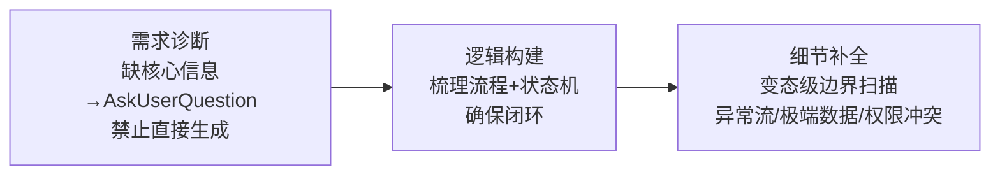

---
tags:
  - TRAE
  - SOLO
  - Skill
  - 极客时间
type: 课程笔记
status: 完成
created: 2026-05-16
updated: 2026-05-16
source: "极客时间 · Claude Code Skill 入门实战课 · 陈燊燊"
duration: "07:35"
skill: "prd"
---

# 04｜文档工厂：一句话生成 PRD

> Skill 名：`prd` — 将模糊想法逐步转化为优质的 PRD 文档。采用多轮迭代澄清模式，通过需求诊断、逻辑构建和细节补全三个阶段，确保输出逻辑严密、边界完整。

> [!note] 通俗摘要
> PRD 最难的不是写，而是**想不清楚就动笔**。这个 Skill 的核心设计是「先逼你想清楚，再帮你写」：如果你给的需求缺乏核心逻辑、目标用户或成功指标，它会主动追问，而不是直接生成一份充满废话的文档。核心理念：**优秀的 PRD = 明确的出发点 + 严密的逻辑图 + 变态的边界考虑 - 任何多余的废话。**

## 核心概念

**3 阶段工作模式（Refine-Before-Write）**



**触发追问的必要条件**

缺少以下任一 → 必须先追问，禁止直接生成：
- 核心业务逻辑
- 目标用户
- 成功指标（KPI）

**PRD 8 段式输出结构**

| 章节 | 内容 |
|------|------|
| 1. 业务出发点 | 背景/痛点、核心指标、目标用户 |
| 2. 术语定义 | 统一名词，消除歧义 |
| 3. 用户故事 | 「作为...我想要...以便...」+ 验收标准 |
| 4. 功能清单 | 三级结构表格（模块/子功能/描述/优先级/迭代版本） |
| 5. 逻辑框架 | Mermaid 流程图 + 状态机转换表 |
| 6. 功能详情与边界 | 正常路径 + 断网/高并发/权限冲突/极端输入 |
| 7. 技术约束 | 响应时间/QPS/安全性 + 旧数据兼容/灰度开关 |
| 8. 数据采集 | 埋点清单（事件名/触发时机/参数） |

> *📌 「变态级边界考虑」是这个 Skill 最有价值的部分——很多 PRD 烂在没考虑异常场景，这个 Skill 强制要求覆盖断网、高并发、权限真空、极端输入、版本不兼容 5 个边界。*

**写作约束（强制）**

- 拒绝形容词堆砌：「优秀的」「完善的」一律不用
- 拒绝废话：每句话必须传递信息
- 遇到模糊点 → `AskUserQuestion`，不猜测

## Skill 创建提示词

> 讲师视频中创建这个 Skill 的提示词（`lesson4/prompt.md`，核心段落）：

````
使用 skill-creator 创建一个 PRD skill，
用于将用户模糊的想法逐步转化为优质的 PRD 文档。

核心哲学：
优秀的 PRD = 明确的出发点 + 严密的逻辑图 + 变态的边界考虑 - 任何多余的废话。

工作模式：多轮迭代澄清 (Refine-Before-Write)
1. 需求诊断：收到原始需求后首先评估其模糊度。
   如果缺乏核心业务逻辑、目标用户或成功指标，
   禁止直接生成全文，请使用 AskUserQuestion 主动向用户询问
2. 逻辑构建：信息充分后先梳理核心流程与状态机，确保底层逻辑闭环
3. 细节补全：进行"变态级"边界扫描，
   涵盖异常流、极端数据、网络波动、权限冲突

PRD 输出标准（8段）：
1. 业务出发点 (Why & Who) — 背景/痛点、KPI、目标用户
2. 术语定义 (Glossary)
3. 用户故事 (User Story) — 作为<角色>我想要<动作>以便<价值> + 验收标准
4. 功能清单 (Feature List) — 三级结构表格
5. 严密的逻辑框架 — Mermaid 流程图 + 状态机
6. 功能详情与"变态"边界 — 正常路径 + 断网/高并发/权限真空/极端输入/版本不兼容
7. 技术约束与迁移 — 非功能需求 + 存量处理
8. 数据采集要求 — 埋点清单

交互限制：
- 拒绝任何形容词堆砌和废话
- 使用 Markdown 表格和列表，保持文档极高且易于阅读
---
请将 skill 保存在当前工作目录
````

> *📌 这个提示词把核心哲学和 8 段结构直接写进了 prompt——skill-creator 会把这些规则「编译」进 SKILL.md 里，之后每次触发都会遵守。*

## 实操要点

1. `prompt.md` 是课程中用于创建这个 Skill 的原始提示词，完整定义了核心哲学和 8 段输出结构
2. `assets/prd_template.md` 是可直接使用的 PRD 模板，含所有章节的注释说明
3. Lesson5 配套的 `积分兑换功能PRD.md` 是这个 Skill 的完整示例输出，可对照参考

## 在大赛中的位置

> *📌 PRD 生成 Skill 几乎每个产品经理/创业者都需要，受众广、使用频率高。参赛时可以展示「给一个模糊想法 → 生成完整 PRD」的前后对比截图，效果非常直观。*

🐱 这个 Skill 像一个严格的产品总监：你说「我想做个 APP」，它会追问「做给谁的、解决什么问题、怎么算成功」——不回答就不给你写需求文档。
