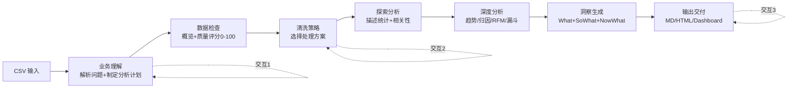

---
tags:
  - TRAE
  - SOLO
  - Skill
  - 极客时间
type: 课程笔记
status: 完成
created: 2026-05-16
updated: 2026-05-16
source: "极客时间 · Claude Code Skill 入门实战课 · 陈燊燊"
duration: "09:53"
skill: "data-analysis"
---

# 06｜数据分析：通过业务数据快速看懂结论

> Skill 名：`data-analysis` — 综合数据分析工作流，将 CSV 数据转化为可操作的业务洞察。支持 7 步分析方法论，3 个交互确认点，多种输出格式（Markdown / 交互 HTML / 完整 Dashboard）。

> [!note] 通俗摘要
> 这个 Skill 把数据分析的专业流程封装了进去：不只是「帮你读 CSV」，而是先理解业务问题，再检查数据质量，再和你确认清洗策略，再做探索性分析，再做深度分析，最后生成带洞察和建议的报告。**「What → So What → Now What」框架**让报告不停留在数字层面，而是直接给出行动建议。配套用了一个真实 SaaS 产品的模拟多表数据集练习。

## 核心概念

**7 步分析流程（含 3 个交互点）**



**数据质量评分**

```
得分 = 100 - 缺失惩罚（最高40）- 重复惩罚（最高20）- 类型错误惩罚（每列10）
≥80 → 自动修复继续
60-79 → 提示问题，确认是否继续
<60 → 警告，建议修复后再分析
```

**深度分析方法映射**

| 业务问题类型 | 分析方法 |
|-------------|---------|
| 趋势随时间变化 | 时间序列 + 移动平均 |
| 归因/因果 | 分组对比 + 贡献分解 |
| 用户行为 | 漏斗分析 + 留存 Cohort |
| 客户价值 | RFM 模型（Recency/Frequency/Monetary） |
| 预测 | 线性回归 / 指数平滑 |

**洞察框架：What → So What → Now What**

- **What（核心发现）**：客观事实 + 具体数字
- **So What（业务洞察）**：为什么重要 + 量化影响 + 根因假设
- **Now What（行动建议）**：优先级 + 时间线 + 执行团队

> *📌 「具体数字」是报告质量的底线——「Channel A converts at 8.5%」比「Channel A converts better」有价值得多。*

**三种输出格式**

| 选项 | 内容 | 适用场景 |
|------|------|---------|
| Quick Report | Markdown + PNG 图表 | 邮件/文档/GitHub |
| Interactive Report | 单页 HTML + Chart.js | 演示/交互探索 |
| Full Dashboard | 多页 Web App | 对外汇报/持续监控 |

## 实操要点

1. 配套数据集 `archive/` 是 RavenStack SaaS 模拟数据，含 5 张关联表（accounts/subscriptions/feature\_usage/support\_tickets/churn\_events），总计约 3.3 万行
2. `--quick --auto` 参数可跳过交互点，直接输出快速报告
3. 脚本依赖：pandas、numpy、scipy、matplotlib、seaborn（Skill 内置自动安装逻辑）
4. `evals/evals.json` 提供了标准测试用例，可用于验证 Skill 触发是否正确（含「分析这个数据」「这个数据说明了什么」等多种表达方式）

## 在大赛中的位置

> *📌 数据分析 Skill 对运营、数据分析师、产品经理都有吸引力。参赛时展示「输入一段业务问题 + CSV 路径 → 自动生成可交互报告」的完整流程截图，体现 Skill 的自动化价值。*

🐱 普通数据分析是「告诉你数字是多少」，这个 Skill 是「告诉你数字背后意味着什么，以及你应该怎么做」。
