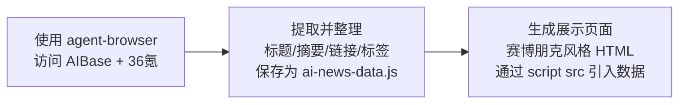

---
tags:
  - TRAE
  - SOLO
  - Skill
  - 极客时间
type: 课程笔记
status: 完成
created: 2026-05-16
updated: 2026-05-16
source: "极客时间 · Claude Code Skill 入门实战课 · 陈燊燊"
duration: "07:27"
skill: "ai-news"
---

# 07｜情报雷达：AI 资讯自动汇总

> Skill 名：`ai-news` — 获取每日最新 AI 资讯并生成赛博朋克风格展示页面。从 AIBase 和 36氪 AI 频道抓取数据，生成 `ai-news-data.js` + `ai-news.html` 两个文件。

> [!note] 通俗摘要
> 这节课教了一个稍微特殊的 Skill：它需要借助另一个外部工具 `agent-browser`（无头浏览器）才能抓取网页数据。核心设计亮点是**数据与展示分离**——抓取的资讯存到 `ai-news-data.js`，展示页面 `ai-news.html` 通过 `<script src>` 引入数据，两个文件可以独立更新。视觉风格选了赛博朋克（霓虹灯、深色背景、科技感），天然契合 AI 话题。

## 核心概念

**工作流**



**数据格式**

```javascript
const NEWS_DATA = [
  {
    "title": "文章标题",
    "description": "80字以内精炼摘要",
    "link": "完整URL",
    "tags": ["AI", "标签1", "标签2"]
  }
];
```

**抓取规格**

- 每个数据源至少 5 条，合计目标 15-20 条
- 去除明显重复（相同主题/相似标题）
- 链接不完整 → 自动补全域名前缀
- 某个数据源失败 → 跳过，继续其他源

> *📌 JS 文件中字符串内部的双引号必须用 `\` 转义——这是个容易踩的坑，SKILL.md 特别提醒了。*

**赛博朋克视觉要点**

- 背景：深蓝/黑色调（`#0a0e27`、`#1a1a2e`）
- 发光效果：`text-shadow` + `box-shadow` 实现霓虹
- 配色：青色、紫色、粉色三色系
- 扫描线或网格背景
- 卡片 hover：发光或抬升效果

## Skill 创建提示词

> 讲师视频中创建这个 Skill 的提示词（`lesson7/安装命令.txt`，节选）：

````
使用 skill-creator 创建一个 AI 资讯 skill，用于获取每日最新的 AI 资讯

Step 1：数据获取
使用 agent-browser skill 分别访问：
1. AIBase — https://www.aibase.com/zh/news
2. 36氪 AI 频道 — https://www.36kr.com/information/AI/

将抓取到的数据整理为以下格式，保存为 ai-news-data.js：
const NEWS_DATA = [{ title, description（80字内）, link, tags（2-4个）}];

注意事项：
- JS 文件中字符串内部的双引号必须在前面加反斜杠转义
- 某个网站无法访问则跳过，每源至少 5 条，合计 15-20 条，去重
- 链接不完整自动补全；tags 根据内容自动推断

Step 2：展示页面
创建赛博朋克风格 HTML 页面，通过 <script src> 引入数据文件（数据与模板分离）
要求：深色背景、霓虹灯效果、卡片式布局、响应式

交付：ai-news-data.js + ai-news.html

请将该 skill 保存到当前工作目录 .claude/skills 下
````

> *📌 「数据与展示分离」的架构设计是这个提示词的亮点——每天只需重新生成 data.js，HTML 模板不变，这种设计思路可以复用到其他动态数据 Skill。*

## 实操要点

1. 必须提前安装 `agent-browser`：
   ```bash
   npm install -g agent-browser
   agent-browser install
   npx skills add vercel-labs/agent-browser --skill agent-browser
   ```
2. `evals/evals.json` 有 3 个测试用例，包括短请求「ai新闻」也要能正确触发
3. 数据文件和展示文件分离：每天更新只需重新生成 `ai-news-data.js`

## 在大赛中的位置

> *📌 自动抓取 + 生成展示页是 More Than Coding 赛道中偏技术向的好选择。参赛时展示「输入一条指令 → 自动获取当日 AI 资讯 → 生成可查看页面」的完整截图，视觉效果好，实用性强。*

🐱 这个 Skill 就像一个每天早上自动帮你刷资讯、整理成一张精美海报贴在墙上的助手——你只需要说「给我今天的 AI 新闻」。
