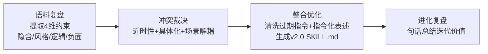

---
tags:
  - TRAE
  - SOLO
  - Skill
  - 极客时间
type: 课程笔记
status: 完成
created: 2026-05-16
updated: 2026-05-16
source: "极客时间 · Claude Code Skill 入门实战课 · 陈燊燊"
duration: "09:21"
skill: "skill-evolver + weekly-report"
---

# 08｜进化管家：经验沉淀与 Skill 迭代

> 本节包含两个 Skill：`skill-evolver`（自动进化 Skill）+ `weekly-report`（周报生成器 v2.0）。前者展示如何通过「对话复盘」把使用经验沉淀回 Skill 本身，后者是进化流程的实际演示成果。

> [!note] 通俗摘要
> 这节课解决一个关键问题：**Skill 用了一段时间后，用户反馈「这里不好」「那里要改」，怎么系统性地把这些经验沉淀回 Skill，而不是每次都重新改 prompt？** `skill-evolver` 给出了答案：4 步流程（语料复盘 → 冲突裁决 → 整合优化 → 进化复盘），把对话经验转化成优化版 Skill。`weekly-report` v2.0 就是 skill-evolver 在实际工作场景（周报生成）里跑出来的结果。

## skill-evolver：4 步自动进化流程



**Step 1：语料复盘 — 4 维提取**

| 维度 | 内容 |
|------|------|
| 隐含约束 | 用户没明说但反复体现的需求 |
| 风格要求 | 输出格式、语气、详略标准 |
| 逻辑澄清 | 步骤优先级、处理顺序、决策逻辑 |
| 负面约束 | 明确禁止或需要避免的事项 |

每条必须引用用户**原始表述**作为证据。

**Step 2：冲突裁决 — 3 个裁决规则**

1. 近时性原则：对话后期的修正 > 前期指令
2. 具体化原则：特定场景约束 > 通用约束
3. 场景解耦：无法合并时用 `如果...则...；否则...` 保留

**Step 3：整合优化 — 铁律**

- 强指令词：**必须**、**始终**、**确保**（做的事）；**严禁**、**禁止**、**切勿**（不做的事）
- 新约束嵌入最相关的原有章节，不追加到末尾
- 包含变更日志：新增/修改/删除

## weekly-report v2.0：周报生成器

> *📌 weekly-report 是 skill-evolver 的实际演示成果：v1.0 基础功能 → 用户反馈「要纯文本/禁用 emoji/禁止占位符 XX」→ skill-evolver 提取约束 → 生成 v2.0。这本身就是一个完整的 Skill 迭代案例。*

**v2.0 三大核心变化**

| 原 v1.0 | v2.0 改进 | 触发原因 |
|---------|----------|---------|
| Markdown 富格式 | 纯文本输出 | 用户反馈偏好纯文本 |
| 使用 emoji | 严禁任何 emoji | 用户明确要求 |
| 允许 XX 占位符 | 强制量化，估算要标注 | 用户要求具体数字 |

**输出格式（纯文本模板）**

```
周报 - [日期范围]
日期：[提交日期]

一、本周工作总结
1.1 已完成
- [任务名称] -- [量化成果]
1.2 进行中
- [任务名称] -- [进度%] -- [预计完成时间]

二、下周工作计划
1. [计划] -- 预计产出：[产出] -- 优先级：P0/P1/P2

三、问题与风险
- [问题] -- [影响] --> [解决方案]
```

## Skill 创建提示词

> 讲师视频中创建 skill-evolver 的提示词（`lesson8/prompt.md`）：

````
使用 skill-creator 创建一个自动进化 Skill，
使用场景：用于在多轮对话结束后，根据用户反馈引导过程，
自动总结经验，然后生成优化版 Skill。

Step 1 语料复盘（Audit）
回顾对话全过程，按结构提取信息：
| 维度 | 提取核心：AI 以后必须做到/避免什么？ | 证据溯源：用户哪句话？ |
1. 隐含约束 / 2. 风格要求 / 3. 逻辑澄清 / 4. 负面约束

Step 2 冲突裁决（Conflict Resolution）
近时性原则（后期>前期）> 具体化原则（特定>通用）> 场景解耦（if-then）

Step 3 整合优化（Extraction）
优先级：核心需求>负面约束>逻辑>风格>隐含约束
使用「必须/始终/严禁/禁止」等强指令词
生成优化版 SKILL.md，包含变更日志

Step 4 进化复盘（Evolution Audit）
"本次进化解决了[痛点]，通过[约束]实现了[质量/效率]的提升。"
---
将 skill 保存到当前目录下
````

> *📌 这是一个「元 Skill」：它创建的 Skill 用于改进其他所有 Skill。参赛时可以展示「Skill v1.0 → 收到用户反馈 → skill-evolver 运行 → v2.0」的完整进化案例，体现 Skill 生命周期管理能力。*

## 实操要点

1. `lesson8/prompt.md` 是 skill-evolver 的创建提示词
2. `skills/skill-evolver/SKILL.md` 是最终生成的 Skill，含完整 4 步工作流
3. `skills/weekly-report/SKILL.md` 是 v2.0 版本，带完整变更日志，可直接对照 v1→v2 的改动
4. `evals/evals.json` 有周报触发的测试用例（「写周报」「本周总结」「汇报工作」等多种表达）

## 在大赛中的位置

> *📌 skill-evolver 本身就是一个适合参赛的 Skill：它解决了「Skill 如何持续改进」这个所有 Skill 创作者都会遇到的问题，角度独特。weekly-report 则是一个典型的 More Than Coding 场景 Skill，受众广。*

🐱 skill-evolver 就像「Skill 的私人教练」：帮你把每次使用后的反馈，系统整理成下一版本的训练计划，而不是随手记在便利贴上。
